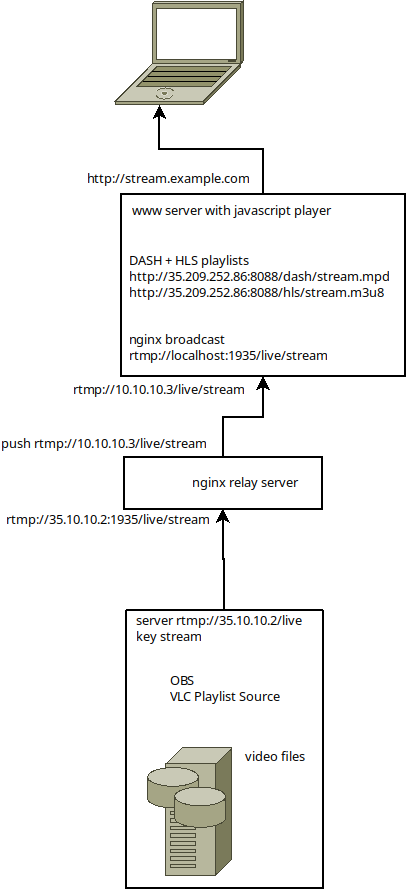

# custom backend notes from my computer

## Ideal setup
Source: OBS, authentication via token over TLS
Transcoder/broadcast relay: also nginx. neat!
Broadcast server: Nginx with RTMP module, authentication is IP based, which means the middle part is more important now

## nginx broadcast infos

https://obsproject.com/forum/resources/how-to-set-up-your-own-private-rtmp-server-using-nginx.50/

Questions:
  Is authentication even important? probably if this is released to public viewers, regardless how unpopular they are
  
## OBS streaming
set server to http://35.209.252.86/live
stream key is the location after /live, so if it is "stream" the stream is at /live/stream

playback source after configuring DASH and HLS
http://35.209.252.86:8088/dash/stream.mpd
http://35.209.252.86:8088/hls/stream.m3u8

streaming transcoding, which might be useful
https://stackoverflow.com/questions/4556867/how-do-i-use-piping-with-ffmpeg

## GCP compute engine settings

Instance sizes
  the oregon data center has some really small instances, they are impossible to upgrade but...
  it's possible to use a medium size for setup, then stop and downgrade when nginx is doing it's thing.
  the bottleneck seems to be disk I/O and CPU, which all this RTMP stuff uses little to none.
  
Network firewall tags:
  http-server
  https-server
  rtmp-server
  dash-hls
  
## network diagram

using a proxy server, the full stack looks like this.

